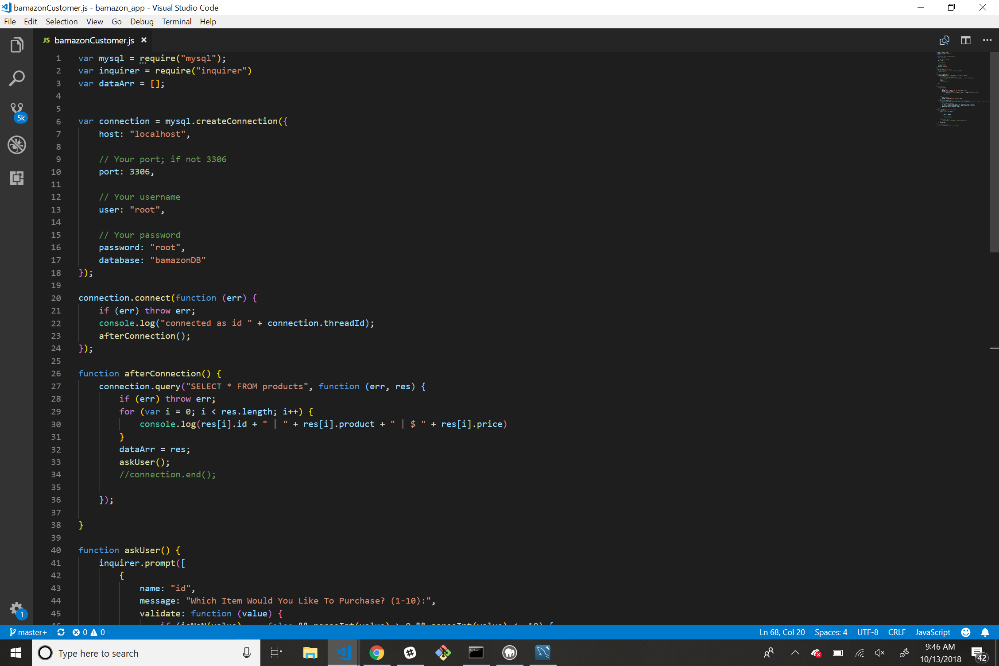

# bamazon

Bamazon is an app that allows the user to select from a pre determined list of objects. The user is prompted if they want to buy an item and how many units of that product they would like. If there was enough stock of the item in inventory, the purchase would be completed, a total for the amount purchased is displayed, and the inventory would be reflect the purchase.

## CODE EXAMPLES:
;
;
;

## WORKING EXAMPLES OF THE CODE:

### Initial List:
;

### Purchase Completed:
;

### Not Enough Inventory:
;